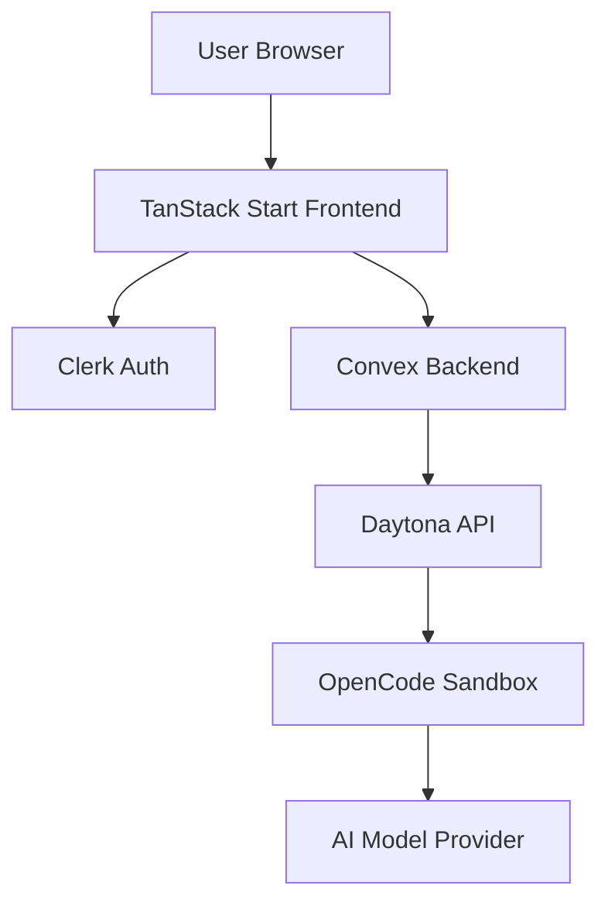
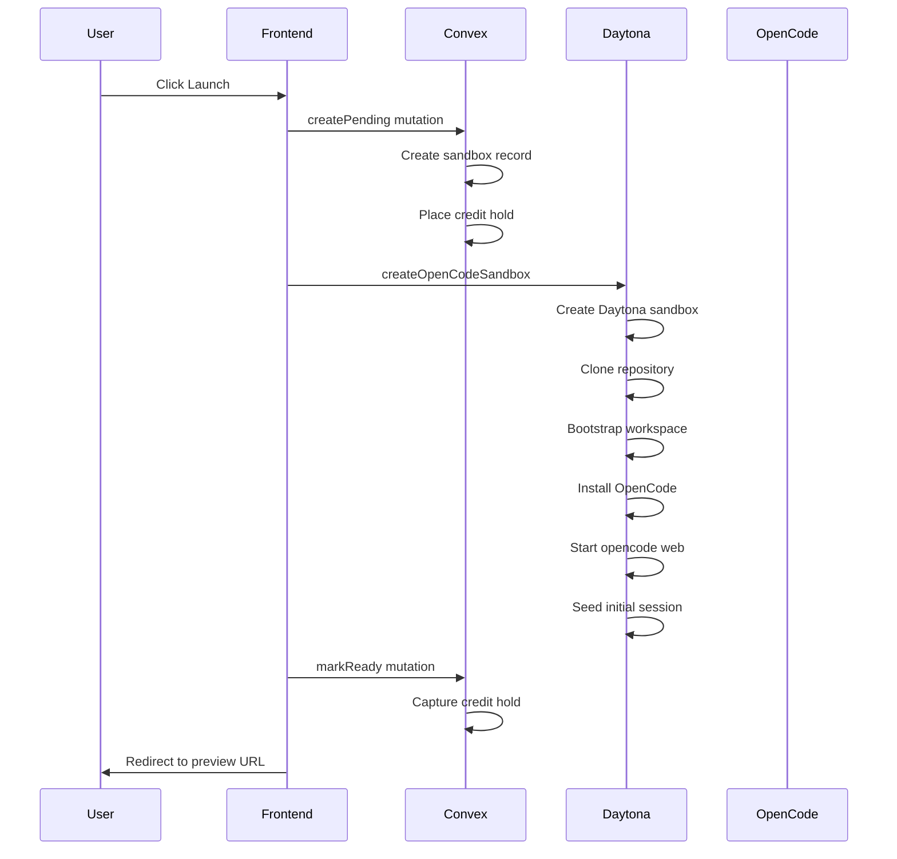

## Overview

BuddyPie is a three-tier application that orchestrates ephemeral development sandboxes with embedded AI assistants.



## Components

### Frontend (TanStack Start)

The web application is built with:

- **TanStack Start** - Full-stack React framework with SSR
- **TanStack Router** - File-based routing
- **Clerk** - Authentication and user management
- **Shadcn UI** - Component library built on Radix UI

<Files>
  <Folder name="src" defaultOpen>
    <Folder name="routes">
      <File name="index.tsx" />
      <File name="_authed.tsx" />
      <Folder name="_authed" />
      <Folder name="api" />
    </Folder>
    <Folder name="components" />
    <Folder name="lib" />
  </Folder>
</Files>

### Backend (Convex)

The backend runs on Convex with:

- Real-time database for sandbox state
- Server functions for orchestration
- Scheduled cron jobs for maintenance
- HTTP actions for webhooks

<Files>
  <Folder name="convex" defaultOpen>
    <File name="schema.ts" />
    <File name="sandboxes.ts" />
    <File name="billing.ts" />
    <File name="user.ts" />
    <File name="http.ts" />
    <File name="crons.ts" />
  </Folder>
</Files>

### Infrastructure (Daytona)

Daytona provides:

- Ephemeral sandbox environments
- Git repository cloning
- Preview URL generation
- SSH access for debugging

## Daytona Integration

The Daytona client (`src/lib/server/daytona.ts`) handles sandbox lifecycle:

### Sandbox Creation Flow

1. **Create Sandbox** - Request a new Daytona environment
2. **Clone Repository** - Git clone with optional authentication
3. **Bootstrap Workspace** - Install dependencies, scaffold docs app if needed
4. **Start OpenCode** - Launch `opencode web` on port 3000
5. **Seed Session** - Create initial AI session with kickoff prompt
6. **Return Preview URL** - Direct link to the OpenCode session

### Key Functions

| Function | Purpose |
|----------|---------|
| `createOpenCodeSandbox` | Full sandbox creation pipeline |
| `deleteOpenCodeSandbox` | Cleanup and removal |
| `ensureSandboxAppPreviewServer` | Start app preview on a port |
| `createSandboxSshAccessCommand` | Generate SSH access command |

### Preview URLs

BuddyPie generates preview URLs using Daytona's preview link API:

```
https://{PORT}-{sandbox-id}.daytonaproxy01.net
```

OpenCode session URLs include the workspace path:

```
https://3000-{sandbox-id}.daytonaproxy01.net/{encoded-path}/session/{session-id}
```

## OpenCode Integration

OpenCode runs inside each Daytona sandbox with preset-specific configuration.

### Configuration Generation

The `buildOpenCodeConfig` function generates:

```json
{
  "$schema": "https://opencode.ai/config.json",
  "model": "openrouter/minimax/minimax-m2.7",
  "default_agent": "general-engineer",
  "instructions": [".buddypie/opencode/AGENTS.md"],
  "permission": {
    "skill": {
      "*": "deny",
      "buddypie-general-architecture": "allow"
    }
  },
  "agent": {
    "general-engineer": {
      "description": "Balanced repo analysis and implementation",
      "mode": "primary",
      "model": "openrouter/minimax/minimax-m2.7",
      "prompt": "You are running in a Daytona sandbox..."
    }
  }
}
```

### Managed Files

BuddyPie writes these files to each sandbox:

| Path | Content |
|------|---------|
| `.buddypie/opencode/AGENTS.md` | Preset instructions |
| `.opencode/skills/{id}/SKILL.md` | Preset skills |
| `.git/info/exclude` | Hide managed files from git status |

## Workspace Bootstrap

The `docs-writer` preset includes special workspace bootstrap:

1. In BuddyPie-prepared docs sandboxes, clone Fumadocs reference repo to `sources/fumadocs`
2. Add `sources/` to `.gitignore`
3. Check for existing `docs/` directory
4. Scaffold Fumadocs app if needed

### Bootstrap Configuration

```ts
workspaceBootstrap: {
  kind: 'fumadocs-docs-app',
  sourceRepoUrl: 'https://github.com/fuma-nama/fumadocs.git',
  sourceRepoBranch: 'main',
  sourceRepoPath: 'sources/fumadocs',
  docsTemplate: 'tanstack-start',
  preferredDocsPath: 'docs',
  fallbackDocsPath: 'docs-site',
  packageManager: 'bun',
}
```

## App Preview Server

Sandbox workspaces can run development servers with auto-detected configuration:

### Supported Frameworks

| Framework | Detection | Preview Command |
|-----------|-----------|-----------------|
| Next.js | `next` dependency | `next dev --hostname 0.0.0.0 -p {port}` |
| Vite | `vite` dependency | `vite --host 0.0.0.0 --port {port}` |
| Astro | `astro` dependency | `astro dev --host 0.0.0.0 --port {port}` |
| Expo | `expo` dependency | `expo start --web --port {port}` |
| CRA | `react-scripts` | `react-scripts start` |

### Script Detection Order

1. `dev:web`
2. `dev`
3. `start`
4. `web`
5. `server`

## Data Flow

### Sandbox Launch Sequence



### Credit Hold Flow

1. User initiates launch
2. `createPending` places hold on credit account
3. Sandbox creation proceeds
4. On success: `markReady` captures the hold
5. On failure: `markFailed` releases the hold

## Error Handling

### Launch Failures

If sandbox creation fails:
1. Daytona sandbox is deleted (best effort)
2. Credit hold is released
3. Error message is stored in the sandbox record
4. User sees failure state in dashboard

### Timeout Handling

| Operation | Timeout |
|-----------|---------|
| OpenCode startup | 15 seconds |
| App preview start | 40 seconds |
| Port probe | 1.2 seconds |

## Security

### Authentication

- All API routes require Clerk authentication
- Convex functions verify user identity
- Sandbox operations are user-scoped

### Environment Isolation

- Each sandbox runs in isolated Daytona environment
- API keys injected at runtime, not stored in repo
- Managed files excluded from git status

### Key Management

AI provider keys are server-side only:
- `OPENROUTER_API_KEY` - Server environment
- `VENICE_API_KEY` - Server environment
- Keys are injected into sandbox at launch time

## Next Steps

<Cards>
  <Card title="Data Model" href="/docs/data-model">
    Database schema and relationships.
  </Card>
  <Card title="API Reference" href="/docs/api-reference">
    Backend function signatures.
  </Card>
</Cards>
